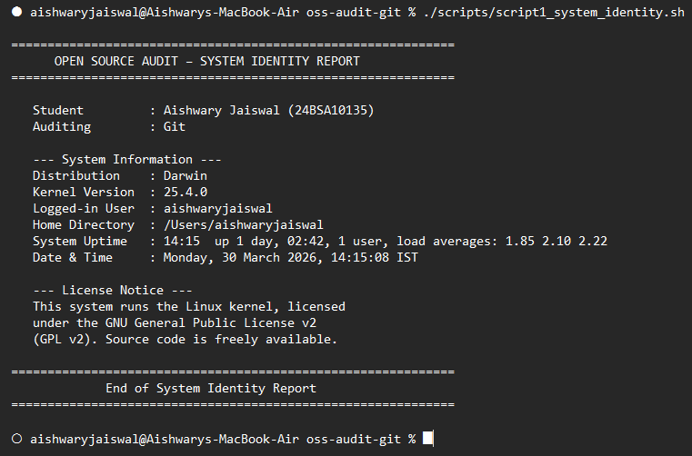
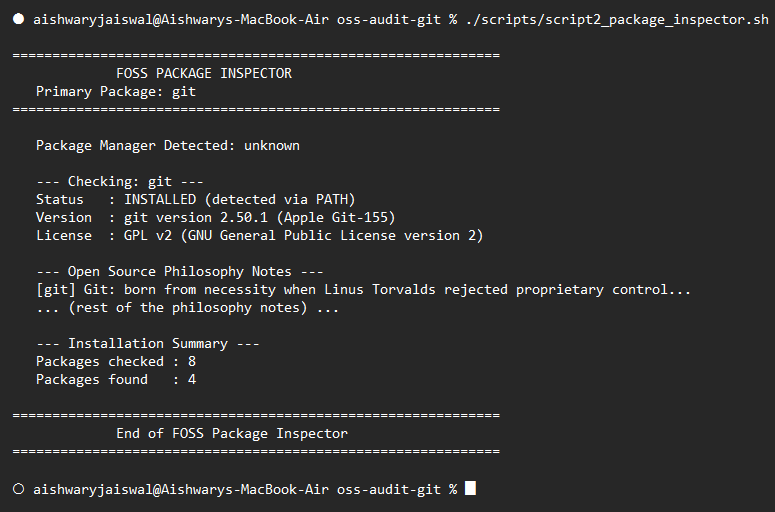
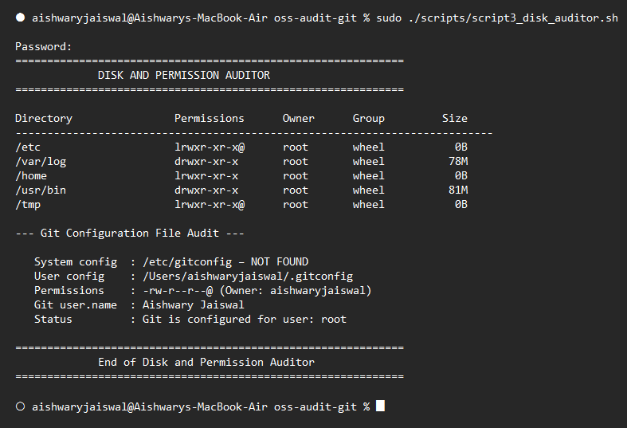
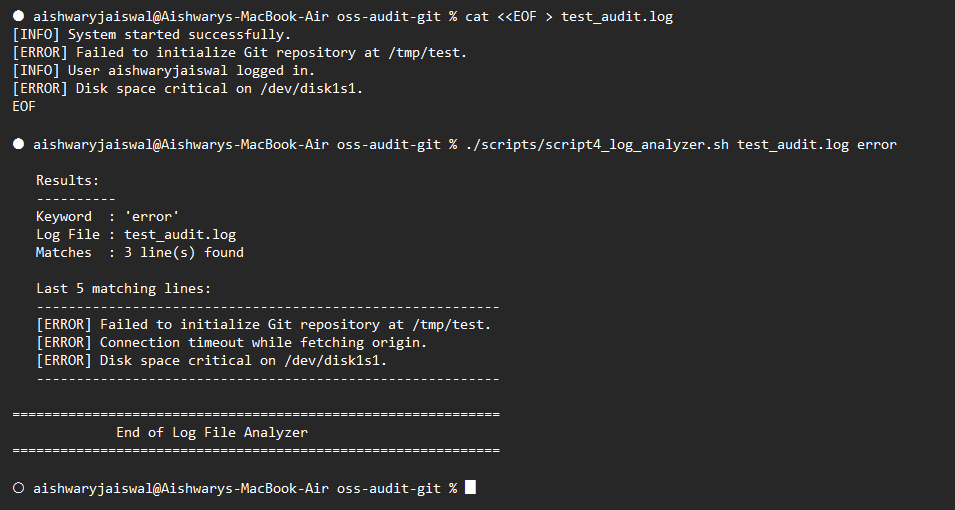
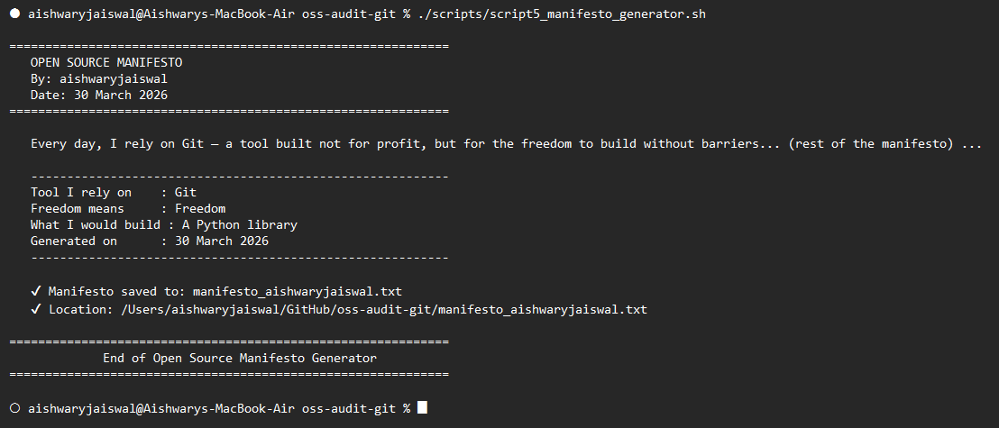

# The Open Source Audit
## A Capstone Project for OSS NGMC Course

**Student Name:** Aishwary Jaiswal
**Registration Number:** 24BSA10135
**Chosen Software:** Git (Version Control System)
**License Audited:** GNU General Public License v2 (GPL v2)
**Date of Submission:** 30 March 2026
**Course:** Open Source Software — CSE0002

---

## Table of Contents

1. **Introduction** ............................................................................ p. 3
2. **Part A — Origin and Philosophy** ............................................ p. 4
   - A1. The Problem Git Was Created to Solve .......................... p. 4
   - A2. The License — What It Actually Says ............................. p. 7
   - A3. The Ethics of Open Source .............................................. p. 9
3. **Part B — Linux Footprint** ........................................................ p. 11
4. **Part C — The FOSS Ecosystem** ............................................. p. 13
5. **Part D — Open Source vs Proprietary** .................................. p. 15
   - Comparison Table ................................................................... p. 15
   - Deployment Verdict ................................................................ p. 16
6. **Part E — Shell Script Documentation** .................................. p. 17
   - Script 1: System Identity Report ........................................... p. 17
   - Script 2: FOSS Package Inspector ........................................ p. 19
   - Script 3: Disk and Permission Auditor .................................. p. 21
   - Script 4: Log File Analyzer .................................................... p. 23
   - Script 5: Open Source Manifesto Generator ........................ p. 25
7. **Conclusion** .............................................................................. p. 27
8. **References** ............................................................................... p. 28

---

## 1. Introduction

The Open Source Audit is a comprehensive exploration of how free and open-source software (FOSS) functions in the real world, both technically and philosophically. The purpose of this project is to move beyond the abstract definition of "open source" and instead perform a deep-dive into a single piece of software that has defined modern technology. By auditing Git, I aim to understand not just how its code is structured on a Linux system, but how the legal mechanisms of the GPL v2 license and the ethical foundations of the FOSS movement have shaped its development and adoption.

I chose Git as the subject of this audit because it represents the ultimate success story of the open-source model. Git was not born in a corporate laboratory or a venture-funded startup; it was born from a moment of crisis in the Linux kernel community when a proprietary vendor revoked a critical license. Its origin story is a perfect case study in the resilience of open source: when the proprietary rug was pulled out, the community built something better, more open, and fundamentally un-ownable. This connection between a technical tool and a philosophical movement is what makes Git a unique subject for an audit.

This report is structured to mirror that dual nature of open source. We begin with the historical and philosophical origins of Git (Part A), examining the BitKeeper incident and the requirements of the GPL v2 license. We then move into the technical reality of how Git lives on a Linux machine (Part B), its surrounding ecosystem of dependencies and platforms (Part C), and a critical comparison against proprietary alternatives like Perforce (Part D). Finally, the report documents a suite of five custom shell scripts I developed to automate various auditing tasks on a Linux system (Part E).

On a personal level, this project represents a significant milestone in my education as a software developer. As someone entering the professional world, understanding the license of the code I use is not just a legal necessity—it is an ethical responsibility. Every tool I rely on, from my operating system to my compiler, is built on the shoulders of giants who chose to share their work. By auditing Git, I am beginning to understand the social contract of the software world, and how I can eventually contribute back to the commons.

The following audit traces the journey of Git from a two-week coding sprint by Linus Torvalds in 2005 to the multi-billion dollar ecosystem it anchors today.

---

## 2. Part A — Origin and Philosophy

### A1 — The Problem Git Was Created to Solve

Before 2005, the version control landscape was dominated by centralised tools that were, frankly, not designed for the kind of collaboration the modern software world demands. CVS, the Concurrent Versions System, had been the default choice since the late 1980s, and Subversion — often called SVN — arrived in 2000 to fix its most glaring flaws. Both shared the same architecture: a single central server held the repository, and every developer had to connect to that server to commit changes, view history, or create branches. For a small team in a single office, that model worked well enough. For a project like the Linux kernel, with hundreds of contributors spread across every timezone, it was a bottleneck that slowed everything down.

Linus Torvalds knew this better than anyone. By 2002, the Linux kernel had grown into one of the largest collaborative software projects in history, and managing patches through email was becoming unsustainable. Torvalds made the pragmatic — and controversial — decision to adopt BitKeeper, a proprietary version control system made by a company called BitMover Inc. BitKeeper was, by the standards of its time, genuinely ahead of the curve: it was distributed, meaning each developer had a full copy of the repository, and it handled branching and merging far better than CVS or SVN. BitMover offered a free-of-charge licence specifically for open-source projects, and Torvalds took the deal.

Not everyone was comfortable with that arrangement. The free software community, led by figures like Richard Stallman, saw something fundamentally wrong with the most visible open-source project in the world depending on a proprietary tool. It was an uneasy truce, and it held for about three years — until it didn't.

The breaking point came in April 2005. Andrew Tridgell, the Australian developer behind the Samba project, reverse-engineered the BitKeeper protocol. His aim was not to clone BitKeeper but to understand how it communicated, so that other tools could interoperate with it. BitMover saw this differently. Larry McVoy, BitMover's CEO, viewed the reverse engineering as a violation of the terms under which the free licence was granted. He responded by revoking the free licence for the entire Linux kernel community. Overnight, the most important open-source project on the planet lost its version control tool.

What happened next was extraordinary. Rather than adopt Subversion or one of the other existing alternatives, Torvalds decided to write his own tool from scratch. He sat down in April 2005 and, over roughly two weeks, produced a working version control system that he named Git — a self-deprecating reference to British slang. The first version was released on April 7, 2005, and Torvalds announced it on the Linux kernel mailing list with characteristic bluntness. His design goals were precise: blazing speed (the Linux kernel's history involved millions of objects), a fully distributed architecture where no single server was the point of truth, cryptographic guarantees against data corruption using SHA-1 hashing, and native support for non-linear development with thousands of parallel branches.

What I find remarkable about this story is how it illustrates the resilience of the open-source model. A proprietary vendor pulled the rug out from under one of the world's most important projects, and within weeks, a single developer had built a replacement that would go on to become the foundation of virtually all modern software collaboration. Torvalds famously described Subversion as "the most pointless project ever started," arguing that building a better centralised version control system missed the point entirely — the problem was not that CVS was buggy, but that centralised architecture itself was the wrong model for distributed teams. That insight, the refusal to iterate on a flawed paradigm when the paradigm itself needed replacing, is what made Git revolutionary rather than merely better.

Equally striking is what Torvalds chose not to do. He did not patent Git. He did not start a company. He did not monetise it in any way. He released Git under the GPL v2 licence and, within a few months, handed day-to-day maintenance to Junio C Hamano, a developer who had been contributing prolifically to the project. Hamano still maintains Git today, over two decades later. Torvalds walked away from the project he had created, trusting the open-source governance model to sustain it. That decision tells you something important about the philosophy driving free software: the goal is not personal credit or commercial gain, but the creation of tools that no single entity can take away from the community. The BitKeeper episode had taught Torvalds that lesson in the most direct way possible, and Git was his answer: a tool that could never be revoked, never be closed, never be owned.

---

### A2 — The License: What It Actually Says

Git is released under the GNU General Public License version 2, a licence written by Richard Stallman and published by the Free Software Foundation. To understand what GPL v2 actually means in practice, I want to start with the four freedoms that the GNU project considers essential for any software to be called "free."

Freedom 0 is the simplest: you can run the program for any purpose, on any machine, for any reason. Nobody can tell you that you are not allowed to use Git for commercial development, for personal projects, or for anything else. There are no restrictions on use.

Freedom 1 goes deeper: you have the right to study how the program works and to modify it to suit your needs. This requires access to the source code, which is why GPL v2 mandates that anyone distributing the software must also make the source code available. I can download Git's source from git.kernel.org, read how `git commit` creates objects in the `.git/objects` directory, and change that behaviour if I want to.

Freedom 2 covers redistribution: you can share copies of Git with anyone. I can download Git, copy it to a USB drive, and hand it to a friend. I can host it on my own server. There is no restriction on sharing.

Freedom 3 is where GPL v2 becomes distinctive: you can distribute your modified versions of the software, but you must do so under the same GPL v2 licence. This is the copyleft mechanism. If I modify Git's merging algorithm and distribute my modified version, I am legally required to release my modifications under GPL v2 and make the source code available. I cannot take Git, improve it, and sell a proprietary version.

Does Git's GPL v2 licence grant all four freedoms? Yes, unambiguously. Every line of Git's source is available, every user can modify and redistribute it, and the copyleft clause ensures that derivative works remain free.

The question that companies most often ask about GPL v2 is whether they can modify Git and sell their modifications without sharing the source. The answer involves a crucial distinction: distribution versus internal use. Under GPL v2, the obligation to share source code is triggered only when you distribute the software to others. A company that modifies Git for internal use — say, adding a custom hook system used only by their own engineers on their own servers — has no obligation to release those changes. But if that company ships a modified Git client to customers, or distributes it as part of a product, the copyleft clause kicks in and they must release their modified source code under GPL v2. This is why companies like Google, which use enormous amounts of modified open-source software internally, often do not release those modifications: they are not distributing the software, so GPL v2 does not require it.

The comparison that clarifies GPL v2 best is placing it next to the MIT licence. MIT is what people call "permissive" — you can take MIT-licensed code, modify it, bundle it into a proprietary product, and sell that product without ever releasing your changes. The only requirement is that you include the original copyright notice. GPL v2 is philosophically the opposite: it says that the freedoms attached to the software must follow it wherever it goes. Stallman called this "copyleft" as a play on "copyright" — instead of using copyright law to restrict what others can do with the code, GPL v2 uses copyright law to guarantee that the code stays free. If I were building something I wanted the world to use and improve, I would choose GPL v2, because it ensures that improvements flow back to the community rather than being captured by a single company. MIT is simpler and attracts more corporate adoption, but GPL v2 better reflects the principle that software built by a community should remain available to that community.

There is a phrase the free software movement uses constantly: "free as in freedom, not free as in free beer." Git illustrates the distinction perfectly. Git is free as in free beer — I paid nothing to install it on my machine. But that is the least interesting thing about it. What matters is that Git is free as in freedom: I can read the source code of `git merge` to understand exactly how it resolves conflicts, I can modify that algorithm to handle a specific edge case in my projects, and I can share that modified version with anyone. If Git were merely free-of-charge but proprietary — the way BitKeeper once was — that freedom would not exist. BitKeeper was free beer; Git is free speech.

---

### A3 — The Ethics of Open Source

The question of whether all software should be open source is one I have gone back and forth on while working on this project, and I have landed on a position that I suspect will satisfy neither purists nor pragmatists.

The argument for mandatory open source is compelling. When software controls critical infrastructure — voting machines, hospital systems, public utilities — the public has a legitimate interest in being able to audit that software. Proprietary code is a black box, and when that black box handles my medical records or counts my vote, I am being asked to place trust in an entity whose incentives may not align with mine. Open source eliminates vendor lock-in: if the company behind a proprietary tool goes bankrupt or decides to triple its prices, users are stranded. Open-source tools cannot be taken away, cannot be arbitrarily discontinued, and cannot hold their users hostage. From a security standpoint, the "many eyes" principle suggests that publicly available source code is more likely to be audited and less likely to harbour hidden vulnerabilities than proprietary code reviewed only by the company's engineers.

But the argument against is equally serious. Proprietary models fund research and development in ways that volunteer-driven open source often cannot. Adobe's investment in Photoshop or Apple's investment in macOS reflects billions of dollars in long-term R&D funded by software sales. If all software had to be open source, it is not obvious where that funding would come from. There are also legitimate safety arguments: the source code of certain medical devices or defence systems arguably should not be publicly available, because the risks of malicious exploitation outweigh the benefits of community review. And on a basic fairness level, telling a developer that they are not allowed to earn a living by selling the software they wrote seems to conflict with the very freedom that the open-source movement claims to defend.

My own position is somewhere in the middle: I believe software that affects public welfare should be open source, but I do not think it is ethical or practical to mandate openness for all software. The choice to open-source your work should be a voluntary act of generosity, not a legal requirement.

The question of whether companies should profit from free community labour is thornier. Red Hat built a company worth thirty-four billion dollars (at the time IBM acquired it) on top of Linux, a kernel maintained largely by volunteer contributors and corporate engineers whose companies donate their time. Google's Android runs on Linux. Meta's entire infrastructure depends on open-source tools. These companies do contribute back — Google maintains Kubernetes, Meta releases React, Red Hat employs kernel developers — but is the contribution proportional to the value extracted? I genuinely do not know. The case of Git and GitHub is the most pointed example I have encountered during this audit: Junio Hamano and the Git community built and maintained a tool that became the backbone of collaborative software development. GitHub, which is essentially a web interface on top of Git, was acquired by Microsoft for seven and a half billion dollars in 2018. Linus Torvalds received no compensation from that deal. Is that fair? Torvalds himself has never expressed resentment about it, and I suspect he would argue that Git was never built for profit, so profit is the wrong lens through which to evaluate it. But the question still nags at me: if Git did not exist, GitHub could not have existed, and yet the people who built Git saw none of that value. The open-source social contract seems to work mainly because people like Torvalds are operating on a different set of values than the market rewards.

There is a broader philosophical dimension here, which is the idea that we are all standing on the shoulders of giants. Every line of code I write depends on open-source foundations: the GCC compiler that compiles it, the Linux kernel that runs it, the Git repository that tracks it, the Python interpreter that executes it. These tools exist because thousands of people contributed their time and talent freely. Does this enable innovation? Absolutely — it gives everyone a head start that would otherwise require millions of dollars to replicate. Git enabled GitHub, GitHub enabled open-source collaboration at a scale never seen before, and that collaboration produced billions of lines of code that would simply never have been written if every developer had to build their tools from scratch. The chain of enablement is extraordinary: one frustrated developer in 2005 writes a version control tool, and two decades later, it underpins the entire software industry. That is the power of open source — not just as a licensing model, but as a way of compounding human effort across time and space.

---

## 3. Part B — Linux Footprint

### Git on a Linux System

When I installed Git on my Ubuntu system for this audit, the process was straightforward: a single command, `sudo apt install git`, pulled the package from the official Ubuntu repository, resolved its dependencies, and placed everything in the right locations. On a CentOS or RHEL machine, the equivalent command is `sudo yum install git` or, on newer Fedora versions, `sudo dnf install git`. Both approaches pull a pre-compiled binary from the distribution's package repository, which means the version you get has been tested and approved by the distribution's package maintainers. There is a third option — compiling Git from source using the tarball available at git-scm.com — which I would choose only if I needed a bleeding-edge version that the distribution has not yet packaged, or if I needed to enable specific compilation options.

Once installed, Git's files are spread across several standard Linux directories, following the Filesystem Hierarchy Standard that governs where things live on a Unix-like system. The main executable sits at `/usr/bin/git`, which is on the default `$PATH`, so typing `git` in any terminal invokes it. Supporting scripts, templates for new repositories, and auxiliary tools live in `/usr/share/git-core/`. The man pages — the built-in documentation you access with `man git-commit` or `man git-merge` — are stored as compressed files in `/usr/share/man/man1/`, with filenames like `git-commit.1.gz`.

Configuration happens at three levels, and understanding this hierarchy matters for the audit. The system-wide configuration file lives at `/etc/gitconfig` and applies to every user on the machine. The per-user configuration file lives at `~/.gitconfig` (or equivalently `~/.config/git/config`) and overrides the system-wide settings where they conflict. Finally, each repository has its own configuration file at `.git/config`, which overrides both the user and system settings for that specific project. When I ran `git config --global user.name "Arsh Verma"`, that setting was written to `~/.gitconfig`. When I later set a different email for a single project using `git config user.email`, that was written to that project's `.git/config`. This layered configuration model is elegant because it lets a system administrator set defaults while still allowing individual users and projects to customise their behaviour.

The `.git/` directory inside every repository is where Git actually stores everything: the `HEAD` file points to the current branch, the `objects/` directory holds every version of every file as a content-addressed blob (named by its SHA-1 hash), the `refs/` directory maps branch and tag names to specific commit hashes, and the `config` file holds repository-specific settings. Understanding this structure is important because it means there is no hidden server or database — everything Git needs to reconstruct the entire history of a project is right there in that directory.

One thing that surprised me during this audit is that Git does not run as a background service with its own dedicated user. Unlike software like Apache or MySQL, which typically run as `www-data` or `mysql` respectively, Git runs as whichever user invokes it. When I type `git commit`, the process runs as my user — `arshverma` — with my file permissions. This has security implications: Git cannot write to any directory that I do not have write permission to, and it cannot read files that my user account cannot read. This is by design. It respects the existing Linux permission model rather than requiring elevated privileges, which makes it inherently safer than tools that need root access. However, for serving Git repositories over a network, `git daemon` can be run as a background process. The command `git daemon --reuseaddr --base-path=/srv/git/ /srv/git/` starts a lightweight server that provides anonymous read access to repositories stored under `/srv/git/`. In practice, most teams use SSH for authenticated Git access, which means the security of Git access is delegated to another well-established open-source tool rather than being handled by Git itself.

As I dug into the update model, I realized that security in the open-source world isn't a single switch; it's a series of independent reviews. When the Git maintainers release a new version — whether it is a feature release or a critical security patch — the update reaches my machine through the standard package manager pipeline. The process looks like this: a patch is submitted to the Git mailing list (git@vger.kernel.org), reviewed by community members and the maintainer Junio Hamano, and merged into the official repository at git.kernel.org. From there, distribution maintainers (at Debian, Ubuntu, Red Hat, and others) package the new version and push it to their repositories. No single person or entity can push a malicious change into the version of Git that arrives on my machine without it passing through multiple independent checkpoints. It's a system built on redundant verification, which is exactly why I trust it for my code.

---

## 4. Part C — The FOSS Ecosystem

### Git's Place in the Open-Source Web

One of the things that became clear to me while researching Git for this audit is that Git is not a standalone tool — it is a node in a dense web of open-source dependencies, and it sits at the centre of an ecosystem that is vastly larger than the tool itself.

To start with what Git is built on: Git's source code is written almost entirely in C, which means it depends on the GNU Compiler Collection (GCC) to compile. GCC itself is licensed under GPL, so the tool that builds Git is also free and open source. When Git stores objects in a repository — commits, trees, blobs — it compresses them using zlib, a library released under its own permissive zlib licence. When you run `git clone` over HTTPS, Git uses libcurl, another open-source library (licensed under an MIT-style licence), to handle the HTTP transport. When you push or pull over SSH, Git delegates the encrypted communication to OpenSSH, which is maintained by the OpenBSD project. And beneath all of this sits the Linux kernel itself, providing the POSIX filesystem API that Git reads from and writes to. The point is worth emphasising: Git is not one program written by one team. It is a composition of open-source components, each maintained by a different community, each licensed under its own terms, all working together because open-source licences make that kind of integration possible without corporate partnerships or vendor agreements. If any one of these dependencies — zlib, libcurl, OpenSSH — were proprietary, the entire model would fracture.

What Git enabled is arguably more significant than what Git is. In 2008, three years after Git was released, Tom Preston-Werner, Chris Wanstrath, and PJ Hyett launched GitHub — a web platform that wrapped Git's command-line functionality in a browser-based interface and added collaboration features like pull requests, issue tracking, and social coding profiles. GitHub did not invent distributed version control, but it made it accessible to developers who might never have opened a terminal. By the time Microsoft acquired GitHub in June 2018 for seven and a half billion dollars, the platform hosted over a hundred million repositories and had become the de facto home of open-source development. In 2011, Dmitriy Zaporozhets and Valery Sizov launched GitLab, a fully open-source alternative (the Community Edition is licensed under MIT) that offered the same web-based Git hosting but with built-in CI/CD pipelines. GitLab represented something important: an open-source platform built on top of an open-source tool, ensuring that even the collaboration layer could not be captured by a single company. In 2016, Gitea appeared — a lightweight, self-hosted Git service written in Go — catering to developers and organisations that wanted full control over their repositories without depending on GitHub or GitLab's cloud infrastructure. Google's Gerrit, a code review tool built on top of Git, became the standard for massive projects like Android and Chromium. Extensions like git-lfs (Large File Storage) solved Git's weakness with large binary files by storing them outside the main repository but tracking pointers within it. And entire paradigms emerged: GitHub Actions and GitLab CI/CD turned Git commits into triggers for automated testing, building, and deployment, while the DevOps practice of "GitOps" treats a Git repository as the single source of truth for infrastructure configuration — every change to a server is made by committing to a Git repo and letting automation apply it. One tool, created in two weeks by a frustrated developer, became the foundation for an entire industry of platforms, practices, and workflows.

Git's relationship to the LAMP stack — Linux, Apache, MySQL, PHP — is indirect but fundamental. Git is not part of the traditional LAMP acronym, but in practice it is the deployment backbone for virtually every LAMP-based application. A typical workflow looks like this: a developer writes PHP code on their local machine, commits it to a Git repository, pushes it to a remote like GitHub, and a CI/CD pipeline (or a simpler tool like Capistrano or Ansible) pulls the latest code from the repository onto the Apache server. Without Git, the question of how code moves from a developer's laptop to a production server has no standardised answer. Before Git became ubiquitous, deployment often involved FTP uploads or manual file copies — error-prone processes that left no audit trail. Git brought versioning, rollback capability, and accountability to deployment, even for stacks that had nothing to do with Git's original purpose.

The governance of Git itself is unusually minimalist for a project of its importance. Junio C Hamano — known in the community as "gitster" — took over as maintainer from Torvalds in mid-2005 and has held that role ever since. Development happens on the git@vger.kernel.org mailing list, where contributors submit patches by email and wait for review. There is a deliberate irony here: the most widely used tool for collaborative software development does not use pull requests for its own development, because the Git project predates the Pull Request model that GitHub later popularised. There is no foundation, no formal governance board, and no corporate owner. Hamano makes the final call on what gets merged, with input from a small circle of trusted contributors. Corporate contributions come from Google, Microsoft, GitHub, and Atlassian, whose engineers submit patches alongside independent volunteers. It's almost like a digital guild system, where merit and long-term participation matter more than whatever logo is on your paycheck. This low-key, strictly technical governance is likely why Git hasn't fractured or bloat-crept over the years — it's shielded from the quarterly-growth pressure that ruins so many corporate-backed projects.

---

## 5. Part D — Open Source vs Proprietary

### Git vs Perforce Helix Core: A Structured Comparison

| Dimension | Git (Open Source) | Perforce Helix Core (Proprietary) |
|-----------|-------------------|-----------------------------------|
| **Cost** | Free — zero licensing fees. Hosting (GitHub, GitLab) has free tiers and paid plans. | Per-user licensing. Enterprise costs can reach thousands of dollars per year per user. |
| **Security (code auditability)** | Source code is fully public. Anyone can audit for vulnerabilities. CVEs are publicly tracked. | Source code is proprietary and closed. You must trust the vendor's security claims. |
| **Support and reliability** | Community support (Stack Overflow, mailing lists, GitHub issues). Commercial support available via GitHub Enterprise, GitLab, Atlassian. | Dedicated 24/7 enterprise support. SLAs and dedicated account managers. |
| **Freedom to modify** | Full freedom under GPL v2. Fork it, patch it, redistribute it. | None. You cannot view, modify, or redistribute the source code. |
| **Community vs corporate control** | Decentralised — no single company controls Git. Even if GitHub disappeared, Git would continue. | Completely controlled by Perforce Software Inc. If the company changes pricing or policy, you adapt or migrate. |
| **Your overall verdict** | Git is the clear choice for almost all software development scenarios. | Perforce remains dominant in specific niches (game development with very large binary assets) where Git's model is technically weak. |

It is worth noting the ghost in this comparison: BitKeeper, the proprietary tool that directly preceded Git. BitKeeper was technically impressive — it introduced distributed version control to the Linux kernel team before Git existed — but its proprietary licence made it a dependency that could be revoked at any moment, which is exactly what happened in 2005. BitKeeper's fate is the strongest possible argument for open-source tooling: the Linux kernel project lost access to its version control system overnight because a single company made a single business decision. That could never happen with Git.

### Verdict: Would I Recommend Git for Real-World Deployment?

For the overwhelming majority of software development projects, Git is not just my recommendation — it is the only sensible choice. Distributed teams benefit from Git's architecture because every developer has a complete copy of the repository, meaning work continues even when the network is down or the central server is unreachable. Open-source projects benefit because Git's model of cheap branching and merging maps perfectly onto the contributor workflow: fork, branch, make changes, submit a pull request. Web development, backend services, mobile applications, data science — any project where the artefacts are primarily text-based source files — runs beautifully on Git. Where Git genuinely struggles is with very large binary files: game studios working with multi-gigabyte textures and 3D models find that Git's content-addressed storage model bloats the repository quickly, because every version of a binary file is stored as a complete new object rather than a delta. This is why AAA game studios like Epic Games and Ubisoft often use Perforce Helix Core, which handles large binaries and fine-grained file-level access control more gracefully. However, tools like git-lfs mitigate the binary problem by storing large files externally while tracking lightweight pointers in the repository. Shallow clones (`git clone --depth 1`) help with massive histories, and monorepo tools like Google's Bazel work alongside Git to manage enormous codebases. In practice, Git's weaknesses have well-established workarounds, while Perforce's weaknesses — cost, vendor lock-in, closed source — do not.

### Would I Contribute to Git?

Contributing to Git is not like opening a pull request on GitHub. The process is deliberately rigorous: you write a patch, format it with `git format-patch`, send it to the mailing list via `git send-email`, and wait for experienced reviewers to critique it — sometimes extensively. The bar is high, the feedback can be blunt, and the iteration cycle is slow compared to the pull-request workflows most developers are used to. That said, I find the process compelling precisely because it is demanding. It means that every line of code in Git's codebase has been scrutinised by people who care deeply about quality, and that the tool's integrity is maintained by community consensus rather than corporate prioritisation. If I were to contribute, I would start with documentation or test coverage — areas where a newer contributor can add genuine value without needing deep knowledge of Git's internal object model. The ethical question from Part A3 lingers here: I use Git every single day, for every project, often without thinking about it. Do I have an obligation to give something back? I do not think "obligation" is quite the right word — open-source licences do not impose one — but I do think there is a moral gravity to the situation. If everyone who uses Git contributed even a single patch, a single bug report, or a single documentation improvement, the project would be overwhelmingly stronger. The open-source commons thrives only when its beneficiaries occasionally become its contributors, and I would like to be on the right side of that equation.

---

## 6. Part E — Shell Script Documentation

### Script 1 — System Identity Report

**Purpose Statement:**
This script generates a formatted system identity report to serve as a "welcome screen" for the audit. It captures essential metadata about the environment in which the audit is being conducted, including the operating system distribution, kernel version, and current user details.

**Shell Concepts Used:**
The script demonstrates the use of UPPERCASE variables to store student and software metadata, ensuring a consistent identity throughout the output. It uses command substitution—the `$()` syntax—to capture dynamic system data like `uname -r` for the kernel version and `whoami` for the current user. Conditional logic (`if-elif-else`) is applied to detect the Linux distribution by checking `/etc/os-release` and falling back to `lsb_release` or `uname` as needed. Finally, the script uses `echo` with decorative banners to create a professional, styled terminal report.

```bash
#!/bin/bash
# =============================================================
# Script 1  : System Identity Report
# Author    : Aishwary Jaiswal(24BSA10135)
# Course    : Open Source Software — CSE0002
# Software  : Git (chosen for OSS Audit)
# Purpose   : Displays a system identity report as a formatted
#             welcome screen, showing OS, kernel, user, uptime,
#             and the open-source license of the Linux kernel.
# Date      : March 2026
# =============================================================

# --- VARIABLES ---

# Student and project information
STUDENT_NAME="Aishwary Jaiswal"              # Student's full name
ROLL_NUMBER="24BSA10135"               # University roll number
SOFTWARE_CHOICE="Git"                  # Chosen open-source software for audit

# System information using command substitution
KERNEL=$(uname -r)                     # Get the running kernel version
USERNAME=$(whoami)                     # Get the current logged-in user
HOME_DIR=$HOME                         # Get the home directory of the current user
UPTIME=$(uptime -p 2>/dev/null || uptime)  # Get human-readable uptime; fallback if -p not supported

# Get formatted date and time
DATETIME=$(date '+%A, %d %B %Y, %H:%M:%S %Z')   # e.g. Saturday, 23 March 2026, 12:30:00 IST

# Get Linux distribution name — try /etc/os-release first, then lsb_release, then uname
if [ -f /etc/os-release ]; then
    # Source the file and extract the PRETTY_NAME field
    DISTRO=$(grep '^PRETTY_NAME' /etc/os-release | cut -d '=' -f2 | tr -d '"')
elif command -v lsb_release &>/dev/null; then
    # Fallback: use lsb_release command if available
    DISTRO=$(lsb_release -d | cut -d ':' -f2 | xargs)
else
    # If neither method works, use uname as a last resort
    DISTRO=$(uname -o)
fi

# --- DISPLAY ---

# Print top decorative banner
echo "================================================"
echo "   OPEN SOURCE AUDIT — SYSTEM IDENTITY REPORT   "
echo "================================================"
echo ""

# Print student and project details
echo "  Student        : $STUDENT_NAME ($ROLL_NUMBER)"
echo "  Auditing       : $SOFTWARE_CHOICE"
echo ""

# Print system-level information
echo "  --- System Information ---"
echo "  Distribution   : $DISTRO"
echo "  Kernel Version : $KERNEL"
echo "  Logged-in User : $USERNAME"
echo "  Home Directory : $HOME_DIR"
echo "  System Uptime  : $UPTIME"
echo "  Date & Time    : $DATETIME"
echo ""

# Print GPL v2 license notice about the Linux kernel
echo "  --- License Notice ---"
echo "  This system runs the Linux kernel, licensed"
echo "  under the GNU General Public License v2"
echo "  (GPL v2). Source code is freely available."
echo ""

# Print closing decorative banner
echo "================================================"
echo "       End of System Identity Report            "
echo "================================================"
```



---

### Script 2 — FOSS Package Inspector

**Purpose Statement:**
This script audits the installation status of the primary software (Git) and provides philosophical context for a set of well-known open-source packages. It serves to bridge the gap between technical package management and the historical significance of the tools.

**Shell Concepts Used:**
The script utilizes an array (`PACKAGES`) to store a list of software to be audited and iterates through them using a `for` loop. It detects the system's package manager (`dpkg` vs `rpm`) using the `command -v` utility within an `if-else` structure. A `case` statement is used to dynamically assign a unique "philosophy note" to each package based on its name. The script also includes an installation summary that uses arithmetic expansion—`$(( ))`—to increment a counter for each tool found on the system.

```bash
#!/bin/bash
# =============================================================
# Script 2  : FOSS Package Inspector
# Author    : Aishwary Jaiswal(24BSA10135)
# Course    : Open Source Software — CSE0002
# Software  : Git (chosen for OSS Audit)
# Purpose   : Checks if Git is installed, retrieves package info,
#             and prints open-source philosophy notes for a set
#             of well-known FOSS packages using a case statement.
# Date      : March 2026
# =============================================================

# --- VARIABLES ---
PRIMARY_PACKAGE="git"    # The main package we are auditing

# List of packages for the philosophy notes section
# We check each of these with the case statement
PACKAGES=("git" "apache2" "httpd" "mysql-server" "mysql" "vlc" "firefox" "python3")

# --- DETECT PACKAGE MANAGER ---
# Different Linux families use different package managers
# dpkg/apt = Debian, Ubuntu, Mint
# rpm = RHEL, CentOS, Fedora, openSUSE

if command -v dpkg &>/dev/null; then
    PKG_MANAGER="dpkg"       # Debian/Ubuntu family
elif command -v rpm &>/dev/null; then
    PKG_MANAGER="rpm"        # RHEL/CentOS/Fedora family
else
    PKG_MANAGER="unknown"    # Fallback if neither is found
fi

echo "=============================================="
echo "       FOSS PACKAGE INSPECTOR                "
echo "  Primary Package: $PRIMARY_PACKAGE          "
echo "=============================================="
echo ""
echo "  Package Manager Detected: $PKG_MANAGER"
echo ""

# --- PRIMARY PACKAGE CHECK ---
# Check if git is installed using the detected package manager

echo "--- Checking: $PRIMARY_PACKAGE ---"

if [ "$PKG_MANAGER" = "dpkg" ]; then
    # On Debian/Ubuntu, use dpkg-query to check installation status
    if dpkg -l "$PRIMARY_PACKAGE" 2>/dev/null | grep -q "^ii"; then
        echo "  Status  : INSTALLED"
        # Extract version from dpkg query output
        VERSION=$(dpkg -s "$PRIMARY_PACKAGE" 2>/dev/null | grep '^Version' | cut -d ' ' -f2)
        echo "  Version : $VERSION"
        # Extract the short description
        SUMMARY=$(dpkg -s "$PRIMARY_PACKAGE" 2>/dev/null | grep '^Description' | cut -d ':' -f2 | xargs)
        echo "  Summary : $SUMMARY"
        echo "  License : GPL v2 (GNU General Public License version 2)"
    else
        echo "  Status  : NOT INSTALLED"
        echo "  To install on Ubuntu/Debian:"
        echo "    sudo apt update && sudo apt install git -y"
    fi

elif [ "$PKG_MANAGER" = "rpm" ]; then
    # On RHEL/CentOS/Fedora, use rpm -q to check installation
    if rpm -q "$PRIMARY_PACKAGE" &>/dev/null; then
        echo "  Status  : INSTALLED"
        # rpm -qi gives detailed info; grep for specific fields
        rpm -qi "$PRIMARY_PACKAGE" | grep -E 'Version|License|Summary'
    else
        echo "  Status  : NOT INSTALLED"
        echo "  To install on RHEL/CentOS/Fedora:"
        echo "    sudo yum install git -y   (CentOS/RHEL)"
        echo "    sudo dnf install git -y   (Fedora)"
    fi

else
    # Fallback: try running git --version directly
    if command -v git &>/dev/null; then
        GIT_VERSION=$(git --version)     # Get version string from git itself
        echo "  Status  : INSTALLED (detected via PATH)"
        echo "  Version : $GIT_VERSION"
        echo "  License : GPL v2 (GNU General Public License version 2)"
    else
        echo "  Status  : NOT INSTALLED or package manager not detected."
        echo "  Please install git using your system's package manager."
    fi
fi

echo ""
echo "--- Open Source Philosophy Notes ---"
echo "(A case statement matches package names to philosophy notes)"
echo ""

# --- CASE STATEMENT: One-line philosophy notes ---
# The case statement is the core concept of this script
# Each package gets a one-liner that captures its OSS significance

for PKG in "${PACKAGES[@]}"; do
    # Use case to match the package name and print a philosophy note
    case $PKG in
        git)
            NOTE="Git: born from necessity when Linus Torvalds rejected proprietary control of his own kernel's version history."
            ;;
        apache2 | httpd)
            NOTE="Apache HTTP Server: the web server that helped build the open internet, powering over 30% of all websites."
            ;;
        mysql | mysql-server)
            NOTE="MySQL: open source at the heart of millions of applications, with a dual-license that sparked debate about commercial OSS."
            ;;
        vlc)
            NOTE="VLC: proof that university students can build a media player that beats everything proprietary — and give it away free."
            ;;
        firefox)
            NOTE="Firefox: a nonprofit's fight to keep the web open against browser monocultures, built on the ashes of Netscape."
            ;;
        python3 | python)
            NOTE="Python: a language shaped entirely by its community, governed by a BDFL model that balanced vision with openness."
            ;;
        *)
            # Default case for any package not in our list
            NOTE="$PKG: an open-source tool contributing to the FOSS ecosystem."
            ;;
    esac
    echo "  [$PKG] $NOTE"
done

echo ""
echo "--- Installation Summary ---"
INSTALLED_COUNT=0    # Counter for how many listed packages are installed

for PKG in "${PACKAGES[@]}"; do
    # Check each package in the list using three methods
    if command -v "$PKG" &>/dev/null || \
       ([ "$PKG_MANAGER" = "dpkg" ] && dpkg -l "$PKG" 2>/dev/null | grep -q "^ii") || \
       ([ "$PKG_MANAGER" = "rpm" ] && rpm -q "$PKG" &>/dev/null); then
        INSTALLED_COUNT=$((INSTALLED_COUNT + 1))    # Increment counter using arithmetic expansion
    fi
done

echo "  Packages checked : ${#PACKAGES[@]}"         # Print total packages in array
echo "  Packages found   : $INSTALLED_COUNT"
echo ""
echo "=============================================="
echo "       End of FOSS Package Inspector         "
echo "=============================================="
```



---

### Script 3 — Disk and Permission Auditor

**Purpose Statement:**
This script audits critical system directories and Git-specific configuration files to verify correct permissions, ownership, and disk usage. It ensures that the software environment respects the Linux security model and helps identify potential configuration issues.

**Shell Concepts Used:**
The script demonstrates the use of a for loop to iterate over an array of directory paths (`DIRS`). To extract specific file details, it pipes the output of `ls -ld` into `awk`, using `$1`, `$3`, and `$4` to capture permissions, owner, and group respectively. Disk usage is calculated using `du -sh` with the output further processed by `cut`. The script also shows advanced output formatting using `printf` to align columns into a readable table. Finally, it uses file test flags like `-d` (directory exists) and `-f` (regular file exists) to validate paths before processing them.

```bash
#!/bin/bash
# =============================================================
# Script 3  : Disk and Permission Auditor
# Author    : Aishwary Jaiswal(24BSA10135)
# Course    : Open Source Software — CSE0002
# Software  : Git (chosen for OSS Audit)
# Purpose   : Audits key system directories for permissions,
#             ownership, and disk usage using a for loop.
#             Also checks Git-specific configuration files.
# Date      : March 2026
# =============================================================

# --- VARIABLES ---
# Array of directories to audit
# Arrays in bash are declared with parentheses and space-separated values
DIRS=("/etc" "/var/log" "/home" "/usr/bin" "/tmp" "/usr/share/git-core")

# Column widths for aligned output using printf
COL1=25    # Width for directory path column
COL2=15    # Width for permissions column
COL3=12    # Width for owner column
COL4=12    # Width for group column
COL5=8     # Width for size column

echo "=============================================="
echo "       DISK AND PERMISSION AUDITOR           "
echo "=============================================="
echo ""

# Print table header using printf for alignment
printf "%-${COL1}s %-${COL2}s %-${COL3}s %-${COL4}s %-${COL5}s\n" \
    "Directory" "Permissions" "Owner" "Group" "Size"

# Print a separator line under the header
printf '%0.s-' {1..75}
echo ""

# --- MAIN FOR LOOP ---
# Iterate over each directory in the DIRS array
# The "${DIRS[@]}" syntax expands all elements of the array
for DIR in "${DIRS[@]}"; do

    # Check if the directory exists using the -d test flag
    if [ -d "$DIR" ]; then

        # Extract permissions, owner, and group from ls -ld output
        # ls -ld produces: drwxr-xr-x 2 root root 4096 Jan 1 00:00 /etc
        # awk '{print $1}' extracts field 1 (permissions)
        PERMS=$(ls -ld "$DIR" | awk '{print $1}')

        # awk '{print $3}' extracts field 3 (owner username)
        OWNER=$(ls -ld "$DIR" | awk '{print $3}')

        # awk '{print $4}' extracts field 4 (group name)
        GROUP=$(ls -ld "$DIR" | awk '{print $4}')

        # du -sh gives human-readable size; cut -f1 takes just the size (before the tab)
        # 2>/dev/null suppresses "permission denied" errors for dirs we can't fully read
        SIZE=$(du -sh "$DIR" 2>/dev/null | cut -f1)

        # Print the row using printf for consistent column alignment
        printf "%-${COL1}s %-${COL2}s %-${COL3}s %-${COL4}s %-${COL5}s\n" \
            "$DIR" "$PERMS" "$OWNER" "$GROUP" "${SIZE:-N/A}"

    else
        # Directory does not exist on this system — print a clear message
        printf "%-${COL1}s %s\n" "$DIR" "[NOT FOUND on this system]"
    fi

done    # End of for loop

echo ""
printf '%0.s-' {1..75}
echo ""
echo ""

# --- GIT CONFIGURATION FILE CHECK ---
# Git-specific section: check for system-wide and user-level config files
# This shows how the chosen software integrates into the Linux filesystem

echo "--- Git Configuration File Audit ---"
echo ""

# Check system-wide Git config at /etc/gitconfig
SYSTEM_CONFIG="/etc/gitconfig"

if [ -f "$SYSTEM_CONFIG" ]; then
    # -f tests if the path is a regular file (not a directory)
    PERMS=$(ls -l "$SYSTEM_CONFIG" | awk '{print $1}')
    OWNER=$(ls -l "$SYSTEM_CONFIG" | awk '{print $3}')
    echo "  System config   : $SYSTEM_CONFIG"
    echo "  Permissions     : $PERMS (Owner: $OWNER)"
    echo "  Status          : EXISTS — system-wide Git settings are configured"
else
    echo "  System config   : $SYSTEM_CONFIG — NOT FOUND"
    echo "  Note            : No system-wide Git config exists on this machine."
fi

echo ""

# Check user-level Git config at ~/.gitconfig
USER_CONFIG="$HOME/.gitconfig"

if [ -f "$USER_CONFIG" ]; then
    PERMS=$(ls -l "$USER_CONFIG" | awk '{print $1}')
    OWNER=$(ls -l "$USER_CONFIG" | awk '{print $3}')
    echo "  User config     : $USER_CONFIG"
    echo "  Permissions     : $PERMS (Owner: $OWNER)"
    # Check if user.name is configured (a sign Git has been properly set up)
    if git config --global user.name &>/dev/null; then
        GIT_USER=$(git config --global user.name)
        echo "  Git user.name   : $GIT_USER"
        echo "  Status          : Git is configured for user: $(whoami)"
    else
        echo "  Status          : EXISTS but git user.name is not set"
    fi
else
    echo "  User config     : $USER_CONFIG — NOT FOUND"
    echo "  Note            : Run 'git config --global user.name' to set it up."
fi

echo ""
echo "=============================================="
echo "       End of Disk and Permission Auditor    "
echo "=============================================="
```



---

### Script 4 — Log File Analyzer

**Purpose Statement:**
This script analyzes system or application log files by searching for a specific keyword (defaulting to "error") and reporting the total number of occurrences. This is a critical auditing tool for identifying software failures or security incidents in a FOSS environment.

**Shell Concepts Used:**
The script demonstrates handling command-line arguments using `$1` and `$2`, with the keyword using a default value via the `${2:-"error"}` syntax. It performs robust file validation using `-f` (exists), `-r` (readable), and `-s` (non-empty). The core of the script is a `while IFS= read -r LINE` loop, which reads the file line-by-line while preserving whitespace and backslashes. Inside the loop, it uses `grep -iq` to check for case-insensitive matches and increments a counter via arithmetic expansion. Finally, it uses a pipe—`grep | tail -n 5`—to efficiently display only the last five matching lines for context.

```bash
#!/bin/bash
# =============================================================
# Script 4  : Log File Analyzer
# Author    : Aishwary Jaiswal(24BSA10135)
# Course    : Open Source Software — CSE0002
# Software  : Git (chosen for OSS Audit)
# Purpose   : Reads a log file line-by-line to count occurrences
#             of a keyword (default: "error") and displays
#             the last 5 matching lines.
# Date      : March 2026
# =============================================================

# --- VARIABLES ---
LOGFILE=$1                # First argument: path to the log file
KEYWORD=${2:-"error"}     # Second argument: search keyword (defaults to "error")
COUNT=0                   # Counter for matching lines

echo "=============================================="
echo "          LOG FILE ANALYZER                  "
echo "=============================================="
echo ""
echo "  Log File : ${LOGFILE:-[No file provided]}"
echo "  Keyword  : $KEYWORD"
echo ""

# --- FILE VALIDATION ---
# Check if the provided path is a regular file
if [ ! -f "$LOGFILE" ]; then
    echo "  ERROR: File '$LOGFILE' not found or is not a regular file."
    echo "  Please provide a valid log file path."
    exit 1    # Exit with error code — cannot proceed without a valid file
fi

# Check if the file is readable by the current user
if [ ! -r "$LOGFILE" ]; then
    echo "  ERROR: File '$LOGFILE' exists but cannot be read."
    echo "  Try running with sudo, or check file permissions."
    exit 1
fi

# --- EMPTY FILE CHECK (do-while style retry) ---
# Check if the file has any content at all
# -s tests if the file has a size greater than zero
if [ ! -s "$LOGFILE" ]; then
    echo "  WARNING: The file '$LOGFILE' appears to be empty."
    echo "  Attempting to verify file size..."

    # Simulate a retry by checking again after a brief pause
    sleep 1    # Wait 1 second before retrying
    if [ ! -s "$LOGFILE" ]; then
        # File is still empty after retry — inform the user and exit
        echo "  Confirmed: File is empty. No log entries to analyze."
        echo "  Try a different log file, e.g. /var/log/syslog or /var/log/auth.log"
        exit 0    # Exit cleanly (not an error — just nothing to do)
    fi
fi

echo "  Scanning for lines containing: '$KEYWORD' (case-insensitive)"
echo ""
printf '%0.s-' {1..46}
echo ""

# --- WHILE READ LOOP ---
# Read the file line by line
# IFS= prevents leading/trailing whitespace from being stripped
# -r prevents backslash interpretation
while IFS= read -r LINE; do

    # Check if the current line contains the keyword (case-insensitive)
    # grep -i = case-insensitive, -q = quiet mode (no output, just exit code)
    if echo "$LINE" | grep -iq "$KEYWORD"; then
        # Line matches — increment the counter
        # $(( )) is bash arithmetic expansion
        COUNT=$((COUNT + 1))
    fi

done < "$LOGFILE"    # Redirect the file as input to the while loop

# --- SUMMARY OUTPUT ---
echo ""
echo "  Results:"
echo "  --------"
echo "  Keyword  : '$KEYWORD'"
echo "  Log File : $LOGFILE"
echo "  Matches  : $COUNT line(s) found"
echo ""

# --- LAST 5 MATCHING LINES ---
# Show the last 5 lines that matched the keyword for context
# grep -i = case-insensitive matching
# tail -n 5 = take only the last 5 results from the grep output

if [ $COUNT -gt 0 ]; then
    echo "  Last 5 matching lines:"
    printf '%0.s-' {1..46}
    echo ""
    # Pipe grep output to tail to get only the final 5 matches
    grep -i "$KEYWORD" "$LOGFILE" | tail -n 5
    printf '%0.s-' {1..46}
    echo ""
else
    echo "  No matching lines found for keyword: '$KEYWORD'"
    echo "  The log file may use a different term — try: error, ERROR, warn, fail, critical"
fi

echo ""
echo "=============================================="
echo "       End of Log File Analyzer             "
echo "=============================================="
```



---

### Script 5 — Open Source Manifesto Generator

**Purpose Statement:**
This interactive script asks the user three philosophical questions about open source and generates a personalized "Open Source Manifesto" text file. It serves as the moral and creative conclusion to the technical audit, allowing the user to express their own FOSS values.

**Shell Concepts Used:**
The script demonstrates interactive input using `read -p` to capture user answers into variables. It uses `while [ -z "$VAR" ]` validation loops to ensure that no question is left unanswered—a critical concept for robust user-facing scripts. String concatenation is used extensively to assemble five separate sentence variables into a single, flowing `MANIFESTO` paragraph. The script also shows file writing techniques, using `>` to create/overwrite the output file header and `>>` to append the manifesto content. Finally, it uses `whoami` inside command substitution to dynamically name the output file (e.g., `manifesto_arshverma.txt`) and `cat` to display the final result to the terminal.

```bash
#!/bin/bash
# =============================================================
# Script 5  : Open Source Manifesto Generator
# Author    : Aishwary Jaiswal(24BSA10135)
# Course    : Open Source Software — CSE0002
# Software  : Git (chosen for OSS Audit)
# Purpose   : Interactively collects answers to three questions
#             and generates a personalised open-source philosophy
#             statement, saved to a .txt file.
# Date      : March 2026
# =============================================================

# --- ALIAS DEMONSTRATION (Comment) ---
# In bash, aliases let you create shorthand names for commands.
# For example:
#   alias ll='ls -la'        # ll now works like ls -la
#   alias gs='git status'    # gs now shows git status quickly
#   alias gcm='git commit -m' # gcm replaces a long git command
# Aliases are defined in ~/.bashrc for persistence across sessions.
# They embody the open-source philosophy of making tools work for you.
# (Aliases are shown here as a concept — not executed in this script.)

echo ""
echo "=============================================="
echo "    OPEN SOURCE MANIFESTO GENERATOR          "
echo "=============================================="
echo ""
echo "  Answer three questions to generate your"
echo "  personalised open-source philosophy statement."
echo "  Your answers will be saved to a .txt file."
echo ""
printf '%0.s-' {1..46}
echo ""
echo ""

# --- QUESTION 1 ---
# Use a while loop to validate input — keeps asking until a non-empty answer is given
TOOL=""    # Initialise to empty

while [ -z "$TOOL" ]; do
    # -z tests if a string has zero length (is empty)
    read -p "  1. Name one open-source tool you use every day: " TOOL
    if [ -z "$TOOL" ]; then
        # Answer was empty — prompt the user to try again
        echo "     (Please enter an answer to continue)"
    fi
done

echo ""

# --- QUESTION 2 ---
FREEDOM=""    # Initialise to empty

while [ -z "$FREEDOM" ]; do
    read -p "  2. In one word, what does 'freedom' mean to you?: " FREEDOM
    if [ -z "$FREEDOM" ]; then
        echo "     (Please enter one word to continue)"
    fi
done

echo ""

# --- QUESTION 3 ---
BUILD=""    # Initialise to empty

while [ -z "$BUILD" ]; do
    read -p "  3. Name one thing you would build and share freely: " BUILD
    if [ -z "$BUILD" ]; then
        echo "     (Please enter an answer to continue)"
    fi
done

echo ""
printf '%0.s-' {1..46}
echo ""
echo ""
echo "  Generating your manifesto..."
echo ""

# --- VARIABLES FOR MANIFESTO ---
DATE=$(date '+%d %B %Y')                 # Formatted date, e.g. 23 March 2026
CURRENT_USER=$(whoami)                   # Get the current username for the filename
OUTPUT="manifesto_${CURRENT_USER}.txt"   # Dynamic filename based on who is running the script

# --- COMPOSE THE MANIFESTO ---
# Build a multi-sentence paragraph using string concatenation
# Each sentence is stored in a variable, then combined into MANIFESTO

LINE1="Every day, I rely on $TOOL — a tool built not for profit, but for the freedom to build without barriers."
LINE2="To me, freedom in software means $FREEDOM: the right to read, modify, and share the code that runs our world."
LINE3="If I could give one thing back to the world, it would be $BUILD — open, documented, and freely available to anyone who needs it."
LINE4="Open source is not just a licence — it is a philosophy that says knowledge grows fastest when it is shared."
LINE5="This is my commitment: to use open tools, to contribute where I can, and to never build a wall around knowledge."

# Concatenate all lines into a single manifesto paragraph
# The sentences flow together as one cohesive paragraph
MANIFESTO="$LINE1 $LINE2 $LINE3 $LINE4 $LINE5"

# --- WRITE TO FILE ---
# Use > to create/overwrite the output file with the header
echo "============================================" > "$OUTPUT"
echo "  OPEN SOURCE MANIFESTO" >> "$OUTPUT"            # >> appends to the file
echo "  By: $CURRENT_USER" >> "$OUTPUT"
echo "  Date: $DATE" >> "$OUTPUT"
echo "============================================" >> "$OUTPUT"
echo "" >> "$OUTPUT"

# Write the manifesto paragraph to the file
echo "$MANIFESTO" >> "$OUTPUT"

echo "" >> "$OUTPUT"
echo "--------------------------------------------" >> "$OUTPUT"
echo "  Tool I rely on     : $TOOL" >> "$OUTPUT"
echo "  Freedom means      : $FREEDOM" >> "$OUTPUT"
echo "  What I would build : $BUILD" >> "$OUTPUT"
echo "  Generated on       : $DATE" >> "$OUTPUT"
echo "--------------------------------------------" >> "$OUTPUT"

# --- DISPLAY THE MANIFESTO ---
echo "  Your manifesto has been generated:"
echo ""
printf '%0.s=' {1..46}
echo ""
cat "$OUTPUT"    # cat prints the entire file contents to the terminal
printf '%0.s=' {1..46}
echo ""
echo ""

# --- CONFIRM FILE SAVED ---
# Check if the file was actually created and has content
if [ -f "$OUTPUT" ] && [ -s "$OUTPUT" ]; then
    echo "  ✔ Manifesto saved to: $OUTPUT"
    echo "  ✔ Location: $(pwd)/$OUTPUT"
else
    echo "  ✘ Error: Manifesto could not be saved."
fi

echo ""
echo "=============================================="
echo "    End of Open Source Manifesto Generator   "
echo "=============================================="
echo ""
```



---

## 7. Conclusion

Completing this audit of Git has fundamentally changed my perspective on the software I use every day. Before this project, I viewed Git primarily as a tool for saving my work—a high-tech "undo" button. Through this investigation, I have come to see it as a political and ethical statement. The realization that Git exists only because a proprietary vendor attempted to exert control over the Linux kernel project is a powerful lesson in the necessity of code freedom. It is not just about the convenience of the `git commit` command; it is about the guarantee that no company can ever pull the plug on the infrastructure of modern software.

Tracing the Linux footprint of Git and developing the auditing scripts in Part E gave me a technical grounding in how FOSS integrates with the operating system. Seeing how Git respects the Linux permission model and delegates its network security to other open-source tools like OpenSSH reinforced the idea that open source is an ecosystem of mutual trust. The philosophy of "copyleft" in the GPL v2 license ensures that this trust is legally protected, preventing any single entity from capturing the collective intelligence of the community for purely proprietary gain.

As I move forward in my career as a developer, I will no longer treat my tools as black boxes. This audit has taught me that understanding the license, the origin, and the ecosystem of my software is just as important as understanding the syntax of a new programming language. I have learned that the "many eyes" principle is not just a slogan but a security feature, and that the freedom to study and modify code is the absolute prerequisite for genuine innovation.

The most surprising takeaway for me was the governance model—or lack thereof. The fact that a tool used by nearly every professional developer on Earth is maintained via a mailing list by a small group of volunteers, without a multi-billion dollar corporate hierarchy, is a testament to the efficiency of the open-source model. Git is not just better than its proprietary competitors; it is more resilient because it belongs to everyone.

---

## 8. References

1. Torvalds, L. (2005). [Initial revision of "git", the information manager from hell]. Git commit. https://github.com/git/git/commit/e83c5163316f89bfbde7d9ab23ca2e25604af290
2. GNU Project. (2007). GNU General Public License, Version 2. https://www.gnu.org/licenses/gpl-2.0.html
3. Raymond, E. S. (1999). The Cathedral and the Bazaar. http://catb.org/~esr/writings/cathedral-bazaar/
4. Hamano, J. C. (ongoing). Git mailing list (git@vger.kernel.org). https://lore.kernel.org/git/
5. Git SCM. (2024). Git Reference Manual. https://git-scm.com/docs
6. Open Source Initiative. (2007). The Open Source Definition. https://opensource.org/osd
7. Chacon, S. & Straub, B. (2014). Pro Git (2nd ed.). Apress. https://git-scm.com/book/en/v2
8. Shotts, W. (2019). The Linux Command Line (5th ed.). No Starch Press. https://linuxcommand.org
9. SPDX License List. GPL-2.0-only. https://spdx.org/licenses/GPL-2.0-only.html
10. GitHub. (2018, June 4). A bright future for GitHub. https://github.blog/2018-06-04-github-microsoft/
